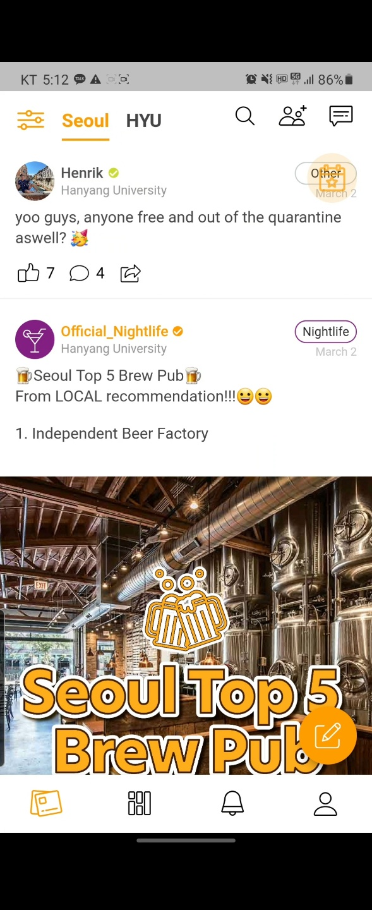
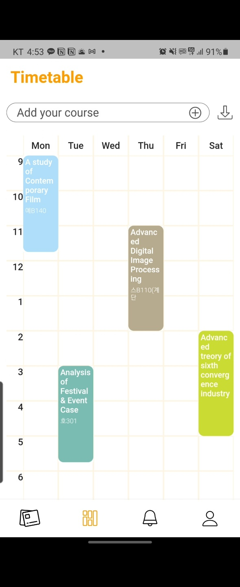
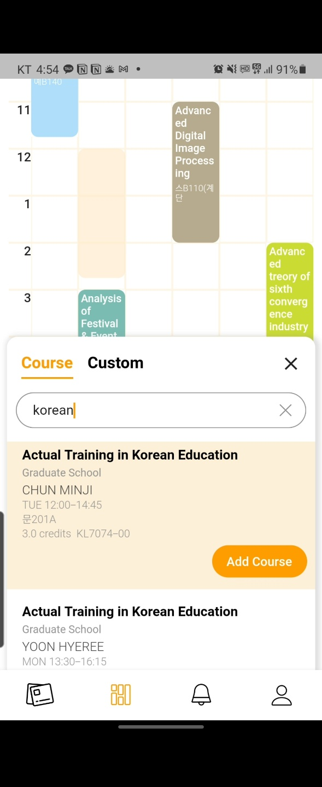
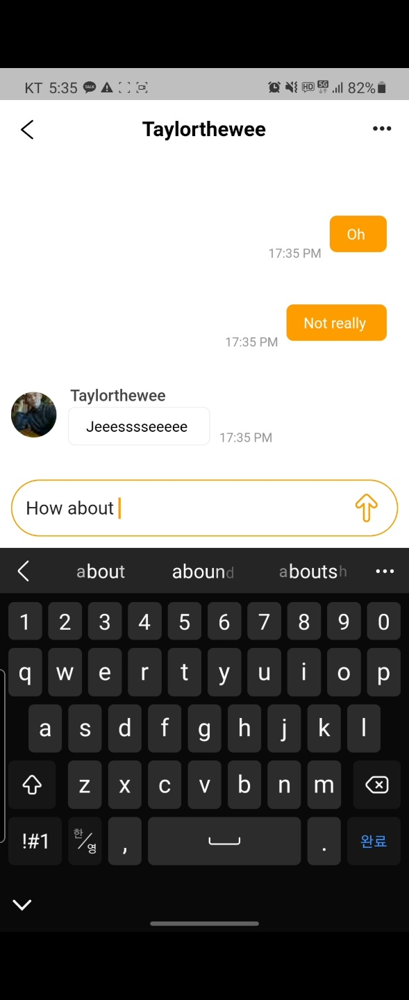
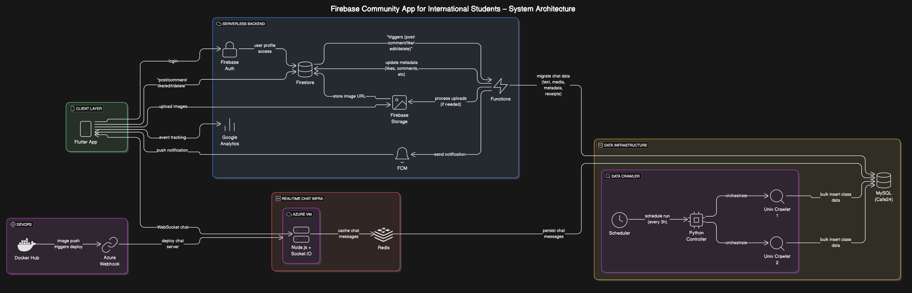

# 프레젤(Pretzel) - 북미 해외 교환/유학생 커뮤니티 서비스

> **시간표 기반 실시간 채팅**을 중심으로 한, 해외 유학생과 교환학생을 위한 커뮤니티 앱

## 👤 개발자

| 이름 | 역할 |
|------|------|
| 김태완 | 시스템 설계, 전체 백엔드 구현, 채팅 서버 구축 및 운영, 데이터 마이그레이션, 배포 자동화, 크롤러 개발 |

## 👤 팀구성
 총 4인(기획자, 디자이너, 개발2) 

---

## 시연 이미지
<p align="center">

    
  
  
  
  
  
  
  
  
</p>


## 아키텍처 도식화


## 프로젝트 개요

Frezel 커뮤니티 앱은 **해외 유학생과 교환학생들이 시간표를 기반으로 자연스럽게 커뮤니티를 형성하고 소통할 수 있도록 설계된 모바일 전용 플랫폼**입니다.  
기본적으로 Firebase 기반의 **서버리스 인프라** 위에서 설계되었으며, 실시간 채팅, 사용자 반응형 알림, 자동화된 수업정보 수집 기능 등을 포함해 **1000명 이상의 사용자**가 실제로 사용한 검증된 MVP입니다.

-  **국내 10개 대학교에서 테스트베드 운영**
-  **약 1,000명의 실제 사용자 확보**
-  **핵심 기능: 시간표 기반 수업별 채팅**
-  **영문 수업 정보 기반 자동 수집 및 활용**

---

## 주요 기능

| 기능 | 설명 |
|------|------|
| 🔐 OAuth 로그인 | Firebase Auth 기반, 이메일/비밀번호 및 Google 로그인 지원 |
| 📝 게시글 및 댓글 | Firestore를 통한 게시글/댓글 CRUD |
| ❤️ 좋아요 및 알림 | 좋아요/댓글 발생 시 FCM으로 푸시 알림 전송 |
| 🕓 시간표 검색 및 구성 | 대학/학기별 **영문 수업 정보** 검색 및 개인 시간표 저장 |
| 💬 **시간표 기반 채팅** | 사용자가 등록한 각 수업마다 채팅방 자동 생성, 실시간 채팅 |
| 📷 이미지 업로드 | Firebase Storage에 이미지 저장, Firestore에 URL 기록 |
| 🔁 수업정보 수집 자동화 | 일부 학교는 API 기반, 대부분은 HTML 파싱 기반 Python 크롤러로 처리 |
| 🚀 채팅 서버 배포 자동화 | Docker Hub + Azure Webhook을 통한 CI/CD 구성 |

---

## 아키텍처 구성

```
Flutter 앱
   │
   ├── Firebase Auth (OAuth 로그인)
   ├── Firebase Firestore (게시물, 댓글, 유저 데이터, 시간표)
   ├── Firebase Storage (이미지 저장)
   ├── Firebase Functions (로직 + 알림 + DB 마이그레이션)
   │      └─ Firestore Trigger → FCM 알림 / MySQL 이관
   │
   ├── FCM (좋아요/답글 푸시 알림)
   ├── Google Analytics (사용자 행동 분석)
   │
   └── WebSocket (채팅 전용 연결)
           ↓
      Node.js + Socket.IO (Azure VM)
           ↓
         Redis (임시 캐시)
           ↓
         MySQL (chat/user/room 저장)
```

---

## 기술 스택

- **Frontend**: Flutter
- **Backend**: Firebase Functions (Serverless)
- **Auth**: Firebase Auth
- **Database**:
  - Firestore (게시글, 시간표, 유저 정보)
  - MySQL (채팅 및 수업 데이터 / 초기 cafe24 사용)
- **Storage**: Firebase Storage
- **Realtime**: Socket.IO + Node.js (Azure VM)
- **Caching**: Redis
- **Notification**: Firebase Cloud Messaging (FCM)
- **Deployment**: Docker Hub + Azure Webhook (Auto Deploy)
- **Monitoring**: Google Analytics
- **Scraping**:
  - Python 기반 크롤러 (대학교별 HTML 구조에 맞춤)
  - 일부 학교는 공식 API 활용
  - 모두 영문 수업 정보를 기준으로 수집

---

## 설계 철학

- **핵심 기능에 집중**: 시간표 → 수업 → 채팅방이라는 직관적인 UX 흐름
- **서버리스 우선**: Firebase 기반 MVP를 빠르게 구축
- **실시간 채팅은 독립 관리**: Socket.IO + Redis 기반 별도 서버 운영
- **수업 정보 자동화**: HTML 기반 크롤러 또는 API로 영문 수업 정보 수집
- **운영 효율과 비용 최적화**: Azure VM + Cafe24 MySQL 활용

---

## 운영 이력

-  국내 10개 대학교에서 테스트베드 운영
-  1,000명 이상의 사용자로부터 피드백 수집
-  안정적인 WebSocket 기반 실시간 채팅 운영 경험 확보

---


